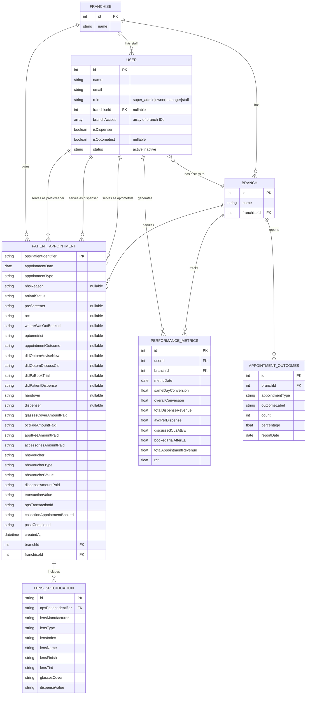

# OptSaaS Entity Relationship Diagram

## Overview
This document contains the Entity Relationship Diagram (ERD) for the OptSaaS application, which is an optical/optometry SaaS platform for managing franchises, branches, staff, and patient appointments.

## ERD Diagram

## Entity Descriptions

### FRANCHISE
- Central entity representing franchise organizations
- Can have multiple branches and users

### BRANCH
- Represents individual branch locations within a franchise
- Handles patient appointments and tracks performance

### USER
- Represents system users with different roles
- Roles: super_admin, owner, manager, staff
- Staff can be optometrists and/or dispensers
- Users can have access to multiple branches

### PATIENT_APPOINTMENT
- Core entity for patient visits and clinical data
- Uses `opsPatientIdentifier` as primary key (external patient ID)
- Tracks appointment details, clinical outcomes, and financial transactions
- Links to optometrist, dispenser, and pre-screener users

### LENS_SPECIFICATION
- Stores lens details for patient prescriptions
- Multiple lens specifications can be associated with one appointment
- Tracks lens properties and dispense values

### PERFORMANCE_METRICS
- Tracks staff performance indicators
- Includes conversion rates, revenue metrics, and appointment statistics
- Calculated per user per branch per date

### APPOINTMENT_OUTCOMES
- Aggregated appointment outcome statistics
- Tracked by branch and appointment type
- Used for reporting and analysis

## Relationships

1. **Franchise → Branch**: One-to-many relationship
2. **Franchise → User**: One-to-many relationship (franchise staff)
3. **Branch → Patient Appointment**: One-to-many relationship
4. **User → Branch**: Many-to-many relationship (branch access)
5. **User → Patient Appointment**: Multiple one-to-many relationships (as optometrist, dispenser, or pre-screener)
6. **Patient Appointment → Lens Specification**: One-to-many relationship
7. **Branch → Performance Metrics**: One-to-many relationship
8. **User → Performance Metrics**: One-to-many relationship
9. **Branch → Appointment Outcomes**: One-to-many relationship

## Notes

1. The system is appointment-centric rather than patient-centric
2. Patients are identified by external identifiers (`opsPatientIdentifier`)
3. Financial tracking is integrated into appointment records
4. Performance metrics are calculated based on appointment data
5. The current implementation uses mock data without a formal database